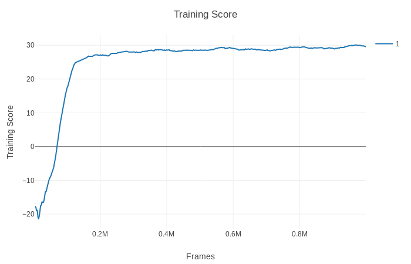
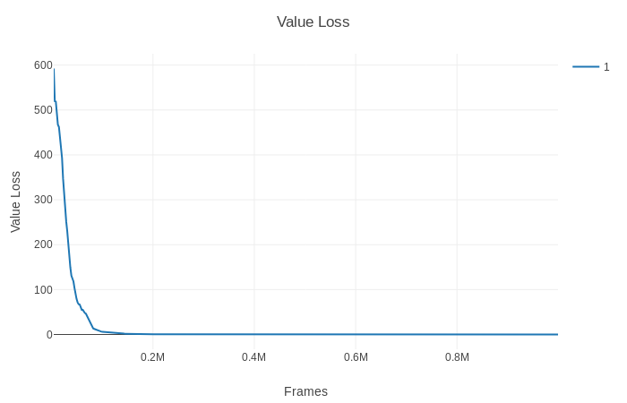
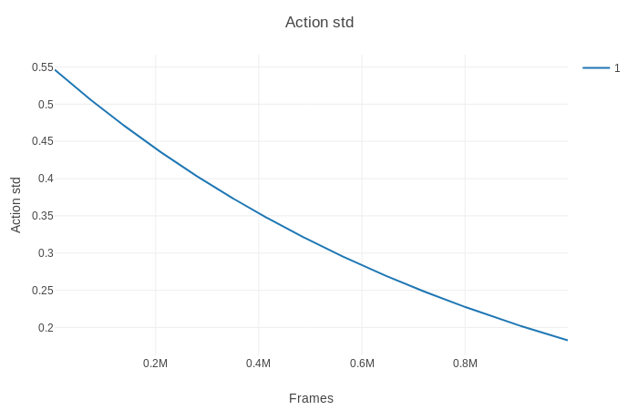

More important fixes
* [ ] Continue training. Save checkpoint
	* [checkpoint](https://discuss.pytorch.org/t/saving-and-loading-a-model-in-pytorch/2610/3)

* [x] make it easy to send in args to env.

## Why does training improve but when loading state dict the result sucks?

Don't know why... might come back.
For now if the tested saved model was good just try til you get rewards like it suppose to have.

Possible Sources:
* [x] Check that StackedState gives same output for all numbers of processes. YES! (memory.py - test())
*	[x] torch.load? - loads corrupt file?
	* torch.load and state dict works well.
	* same input gives same output everytime
* [ ] Environment
	* [x] moters, motor_names - different order? actions goes to wrong joints? NO
	* Behaviour the same between resets.
	* Behaviour different between creation.

* good score with Dict_Dof3_bklabla on DoF2 env..jk.
Plan
* Train and get stable models reliably
	* [ ] Dof2
	* [ ] Dof3

* Get rgb arrays from training
	* [ ] Dof2
	* [ ] Dof3

Project
==========

Roboschool is broken on my setup.
After calling env.reset(), if there has been some type of rendering, the robot and target disappears and all numbers are *nan*.

However, my own CustomReacher environment is now working correctly and using a single process convergence is easily reached.
There still seems to be something wrong with the multiple process setup.

# [Agent](Agent/)
Pytorch training

## Results
A training on my CustomReacher environment.

# [Baselines](Baselines/)
OpenAI baselines training

# [Environments](environments/)

##  custom.py

All custom environments. Wrapper for gym_env code.

##  gym_env.py

Base script that communicates with cpp_houshold, scene and so forth.

## [xml_files](environments/xml_files)
Directory for the xml files.

* custom_reacher
* half_humanoid
* humanoid
* fixed torso
